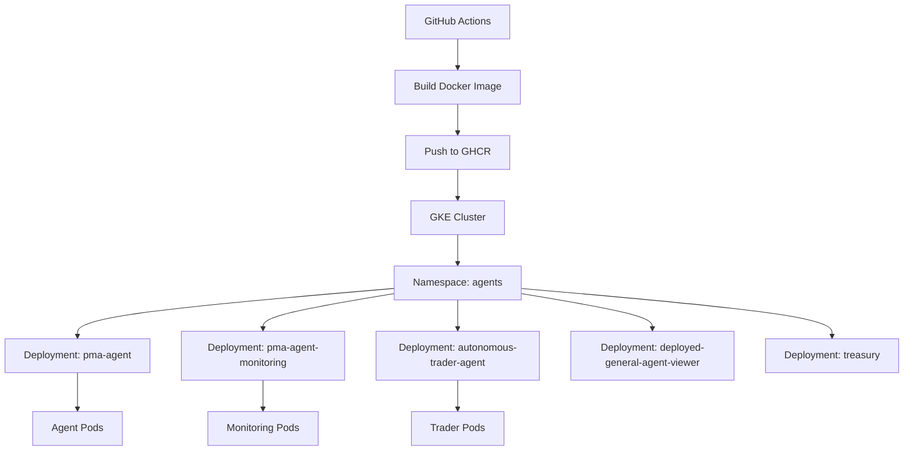

## Overview

Cloud deployment uses Google Kubernetes Engine (GKE) to run agents in a managed Kubernetes environment. This provides high availability, automatic scaling, and seamless integration with Google Cloud services.

## Architecture



## Prerequisites

<CardGroup cols={2}>
  <Card title="Google Cloud Account" icon="google">
    Active GCP project with billing enabled
  </Card>
  <Card title="GKE Cluster" icon="server">
    Running Kubernetes cluster in your GCP project
  </Card>
  <Card title="kubectl" icon="terminal">
    Kubernetes command-line tool configured for your cluster
  </Card>
  <Card title="Docker Image" icon="docker">
    Built and pushed to container registry (GHCR)
  </Card>
</CardGroup>

## Deployment Architecture

### Kubernetes Resources

The application runs in the `agents` namespace with multiple deployments:

<ResponseField name="pma-agent" type="Deployment">
  Main prediction market agent deployment running configured agents
</ResponseField>

<ResponseField name="pma-agent-monitoring" type="Deployment">
  Monitoring and observability services for agent performance tracking
</ResponseField>

<ResponseField name="autonomous-trader-agent" type="Deployment">
  Autonomous trading agent with microchain framework ([deployed here](https://autonomous-trader-agent.ai.gnosisdev.com))
</ResponseField>

<ResponseField name="deployed-general-agent-viewer" type="Deployment">
  Web interface for viewing deployed agent status and performance
</ResponseField>

<ResponseField name="treasury" type="Deployment">
  Treasury management service for fund allocation and tracking
</ResponseField>

## Setup Instructions

<Steps>
  <Step title="Configure kubectl">
    Connect kubectl to your GKE cluster:
    
    ```bash
    gcloud container clusters get-credentials <cluster-name> \
      --region <region> \
      --project <project-id>
    ```
    
    Verify connection:
    
    ```bash
    kubectl cluster-info
    kubectl get nodes
    ```
  </Step>

  <Step title="Create Namespace">
    Create the `agents` namespace if it doesn't exist:
    
    ```bash
    kubectl create namespace agents
    ```
    
    Set as default namespace:
    
    ```bash
    kubectl config set-context --current --namespace=agents
    ```
  </Step>

  <Step title="Configure Secrets">
    Create Kubernetes secrets for sensitive environment variables:
    
    ```bash
    kubectl create secret generic agent-secrets \
      --from-literal=BET_FROM_PRIVATE_KEY="your_private_key" \
      --from-literal=OPENAI_API_KEY="your_openai_key" \
      --from-literal=SERPER_API_KEY="your_serper_key" \
      --from-literal=TAVILY_API_KEY="your_tavily_key" \
      --namespace=agents
    ```
    
    <Warning>
    Never commit secrets to version control. Use secret management tools like Google Secret Manager.
    </Warning>
  </Step>

  <Step title="Create Deployment">
    Create a deployment manifest:
    
    ```yaml deployment.yaml
    apiVersion: apps/v1
    kind: Deployment
    metadata:
      name: pma-agent
      namespace: agents
    spec:
      replicas: 1
      selector:
        matchLabels:
          app: pma-agent
      template:
        metadata:
          labels:
            app: pma-agent
        spec:
          containers:
          - name: agent
            image: ghcr.io/gnosis/prediction-market-agent:main
            env:
            - name: runnable_agent_name
              value: "prophet_gpt4o"
            - name: market_type
              value: "omen"
            - name: BET_FROM_PRIVATE_KEY
              valueFrom:
                secretKeyRef:
                  name: agent-secrets
                  key: BET_FROM_PRIVATE_KEY
            - name: OPENAI_API_KEY
              valueFrom:
                secretKeyRef:
                  name: agent-secrets
                  key: OPENAI_API_KEY
            resources:
              requests:
                memory: "2Gi"
                cpu: "1000m"
              limits:
                memory: "4Gi"
                cpu: "2000m"
            imagePullPolicy: Always
          imagePullSecrets:
          - name: ghcr-secret
    ```
    
    Apply the deployment:
    
    ```bash
    kubectl apply -f deployment.yaml
    ```
  </Step>

  <Step title="Verify Deployment">
    Check deployment status:
    
    ```bash
    kubectl get deployments -n agents
    kubectl get pods -n agents
    kubectl logs -f <pod-name> -n agents
    ```
  </Step>
</Steps>

## Deployment Configuration

### Environment Variables

Configure agents via environment variables in your deployment:

```yaml
env:
- name: runnable_agent_name
  value: "prophet_gpt4o"  # Agent to run
- name: market_type
  value: "omen"  # Target market
- name: BET_FROM_PRIVATE_KEY
  valueFrom:
    secretKeyRef:
      name: agent-secrets
      key: BET_FROM_PRIVATE_KEY
```

### Resource Limits

Set appropriate resource requests and limits:

<CodeGroup>
```yaml Light Agent
resources:
  requests:
    memory: "1Gi"
    cpu: "500m"
  limits:
    memory: "2Gi"
    cpu: "1000m"
```

```yaml Standard Agent
resources:
  requests:
    memory: "2Gi"
    cpu: "1000m"
  limits:
    memory: "4Gi"
    cpu: "2000m"
```

```yaml Heavy Agent (Research/LLM)
resources:
  requests:
    memory: "4Gi"
    cpu: "2000m"
  limits:
    memory: "8Gi"
    cpu: "4000m"
```
</CodeGroup>

### Image Pull Policy

For production, use specific tags instead of `latest`:

```yaml
containers:
- name: agent
  image: ghcr.io/gnosis/prediction-market-agent:v1.2.3
  imagePullPolicy: IfNotPresent  # Only pull if not cached
```

For development, always pull latest:

```yaml
containers:
- name: agent
  image: ghcr.io/gnosis/prediction-market-agent:main
  imagePullPolicy: Always  # Always pull latest
```

## Managing Deployments

### Restarting Deployments

The `restart_app_deployments.sh` script restarts all agent deployments to pick up new container images:

```bash restart_app_deployments.sh
#!/bin/bash
kubectl rollout restart deploy pma-agent -n agents
kubectl rollout restart deploy pma-agent-monitoring  -n agents
kubectl rollout restart deploy autonomous-trader-agent -n agents
kubectl rollout restart deploy deployed-general-agent-viewer -n agents
kubectl rollout restart deploy treasury -n agents
```

Run the script:

```bash
bash restart_app_deployments.sh
```

<Note>
This script is currently used until CI/CD pipeline integration with GKE is complete. DevOps is working on securing the connection between GitHub and GKE for automated deployments.
</Note>

### Rolling Updates

Kubernetes performs rolling updates automatically when you change the deployment:

```bash
# Update image
kubectl set image deployment/pma-agent \
  agent=ghcr.io/gnosis/prediction-market-agent:v1.2.3 \
  -n agents

# Check rollout status
kubectl rollout status deployment/pma-agent -n agents
```

### Scaling

Scale deployments up or down:

```bash
# Scale to 3 replicas
kubectl scale deployment/pma-agent --replicas=3 -n agents

# Auto-scale based on CPU
kubectl autoscale deployment/pma-agent \
  --min=1 --max=5 --cpu-percent=80 \
  -n agents
```

### Rollback

Rollback to a previous deployment version:

```bash
# View rollout history
kubectl rollout history deployment/pma-agent -n agents

# Rollback to previous version
kubectl rollout undo deployment/pma-agent -n agents

# Rollback to specific revision
kubectl rollout undo deployment/pma-agent --to-revision=3 -n agents
```

## Multiple Agent Deployment

Run multiple agents simultaneously with different configurations:

```yaml
apiVersion: apps/v1
kind: Deployment
metadata:
  name: pma-agent-prophet-gpt4o
  namespace: agents
spec:
  replicas: 1
  selector:
    matchLabels:
      app: pma-agent
      agent-type: prophet-gpt4o
  template:
    metadata:
      labels:
        app: pma-agent
        agent-type: prophet-gpt4o
    spec:
      containers:
      - name: agent
        image: ghcr.io/gnosis/prediction-market-agent:main
        env:
        - name: runnable_agent_name
          value: "prophet_gpt4o"
        - name: market_type
          value: "omen"
---
apiVersion: apps/v1
kind: Deployment
metadata:
  name: pma-agent-microchain
  namespace: agents
spec:
  replicas: 1
  selector:
    matchLabels:
      app: pma-agent
      agent-type: microchain
  template:
    metadata:
      labels:
        app: pma-agent
        agent-type: microchain
    spec:
      containers:
      - name: agent
        image: ghcr.io/gnosis/prediction-market-agent:main
        env:
        - name: runnable_agent_name
          value: "microchain"
        - name: market_type
          value: "omen"
```

## Monitoring and Observability

### Viewing Logs

```bash
# Tail logs from a specific pod
kubectl logs -f <pod-name> -n agents

# Logs from all pods in a deployment
kubectl logs -f deployment/pma-agent -n agents

# Previous container logs (if crashed)
kubectl logs <pod-name> -n agents --previous

# Last 100 lines
kubectl logs <pod-name> -n agents --tail=100
```

### Pod Status

```bash
# Get pod status
kubectl get pods -n agents

# Detailed pod information
kubectl describe pod <pod-name> -n agents

# Watch pod status in real-time
kubectl get pods -n agents -w
```

### Resource Usage

```bash
# CPU and memory usage
kubectl top pods -n agents

# Node resource usage
kubectl top nodes
```

### Deployment Dashboard

View agent activity on the Dune dashboard:

<Card title="AI Agents Overview" icon="chart-line" href="https://dune.com/gnosischain_team/ai-agents-overview-omen-prediction-markets">
  Track on-chain activity of deployed agents from this repo
</Card>

## Configuration Management

### ConfigMaps

Use ConfigMaps for non-sensitive configuration:

```yaml
apiVersion: v1
kind: ConfigMap
metadata:
  name: agent-config
  namespace: agents
data:
  market_type: "omen"
  log_level: "INFO"
  free_for_everyone: "1"
```

Reference in deployment:

```yaml
envFrom:
- configMapRef:
    name: agent-config
```

### Secrets Management

Integrate with Google Secret Manager:

```bash
# Enable Secret Manager API
gcloud services enable secretmanager.googleapis.com

# Create secret
echo -n "your-api-key" | \
  gcloud secrets create openai-api-key --data-file=-

# Grant access to GKE service account
gcloud secrets add-iam-policy-binding openai-api-key \
  --member="serviceAccount:<gke-service-account>" \
  --role="roles/secretmanager.secretAccessor"
```

Use with Workload Identity or External Secrets Operator for automatic secret injection.

## CI/CD Pipeline

### Current State

Images are automatically built and pushed to GitHub Container Registry on:
- Pushes to `main` branch
- Pull requests with "build please" in description

### Deployment Process

<Steps>
  <Step title="Code Push">
    Developer pushes code to GitHub
  </Step>
  
  <Step title="CI Build">
    GitHub Actions builds Docker image and pushes to GHCR
  </Step>
  
  <Step title="Manual Deployment" icon="hand">
    Currently, deployments are manually triggered using `restart_app_deployments.sh`
  </Step>
  
  <Step title="Future: Automated CD">
    DevOps is working on automating deployment after successful builds
  </Step>
</Steps>

<Note>
The deployment process will be fully automated once the connection between GitHub Actions and GKE is secured.
</Note>

## High Availability

### Multiple Replicas

Run multiple replicas for redundancy:

```yaml
spec:
  replicas: 3
  strategy:
    type: RollingUpdate
    rollingUpdate:
      maxUnavailable: 1
      maxSurge: 1
```

### Pod Disruption Budget

Ensure minimum availability during updates:

```yaml
apiVersion: policy/v1
kind: PodDisruptionBudget
metadata:
  name: pma-agent-pdb
  namespace: agents
spec:
  minAvailable: 1
  selector:
    matchLabels:
      app: pma-agent
```

### Health Checks

Add liveness and readiness probes:

```yaml
livenessProbe:
  exec:
    command:
    - python
    - -c
    - "import sys; sys.exit(0)"
  initialDelaySeconds: 30
  periodSeconds: 10
  
readinessProbe:
  exec:
    command:
    - python
    - -c
    - "import sys; sys.exit(0)"
  initialDelaySeconds: 10
  periodSeconds: 5
```

## Cost Optimization

<AccordionGroup>
  <Accordion title="Right-size Resources">
    Start with smaller resource requests and scale up based on actual usage:
    
    ```bash
    kubectl top pods -n agents
    ```
    
    Adjust resource limits based on observed consumption.
  </Accordion>

  <Accordion title="Use Preemptible Nodes">
    For non-critical workloads, use GKE's preemptible nodes for ~80% cost savings:
    
    ```yaml
    nodeSelector:
      cloud.google.com/gke-preemptible: "true"
    ```
  </Accordion>

  <Accordion title="Horizontal Pod Autoscaling">
    Scale pods based on actual demand:
    
    ```bash
    kubectl autoscale deployment/pma-agent \
      --min=1 --max=10 --cpu-percent=70 \
      -n agents
    ```
  </Accordion>

  <Accordion title="Cluster Autoscaling">
    Enable GKE cluster autoscaling to add/remove nodes based on pod requirements.
  </Accordion>
</AccordionGroup>

## Troubleshooting

<AccordionGroup>
  <Accordion title="ImagePullBackOff">
    Pod can't pull the Docker image:
    
    ```bash
    # Check image exists
    docker pull ghcr.io/gnosis/prediction-market-agent:main
    
    # Verify image pull secret
    kubectl get secret ghcr-secret -n agents -o yaml
    
    # Recreate secret if needed
    kubectl create secret docker-registry ghcr-secret \
      --docker-server=ghcr.io \
      --docker-username=<username> \
      --docker-password=<token> \
      -n agents
    ```
  </Accordion>

  <Accordion title="CrashLoopBackOff">
    Pod keeps crashing:
    
    ```bash
    # Check logs
    kubectl logs <pod-name> -n agents --previous
    
    # Describe pod for events
    kubectl describe pod <pod-name> -n agents
    
    # Common causes:
    # - Missing environment variables
    # - Invalid configuration
    # - Resource constraints
    ```
  </Accordion>

  <Accordion title="Pending Pods">
    Pods stuck in Pending state:
    
    ```bash
    # Check pod events
    kubectl describe pod <pod-name> -n agents
    
    # Common causes:
    # - Insufficient cluster resources
    # - Node selector/affinity issues
    # - Persistent volume claims not bound
    ```
  </Accordion>

  <Accordion title="Resource Exhaustion">
    Out of memory or CPU:
    
    ```bash
    # Check resource usage
    kubectl top pods -n agents
    
    # Increase resource limits in deployment
    # or scale horizontally
    ```
  </Accordion>
</AccordionGroup>

## Next Steps

<CardGroup cols={2}>
  <Card title="Environment Config" icon="gear" href="/deployment/environment">
    Complete environment variable reference for all agents
  </Card>
  <Card title="Docker Deployment" icon="docker" href="/deployment/docker">
    Learn about the Docker build and container setup
  </Card>
  <Card title="Local Development" icon="laptop-code" href="/deployment/local">
    Test agents locally before deploying to cloud
  </Card>
  <Card title="Monitoring Dashboard" icon="chart-line" href="https://dune.com/gnosischain_team/ai-agents-overview-omen-prediction-markets">
    View live agent performance and activity
  </Card>
</CardGroup>