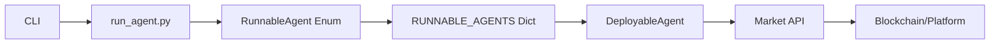

## Overview

Local deployment is the simplest way to run agents during development and testing. The agent runs directly on your machine using Python and Poetry for dependency management.

## Prerequisites

<CardGroup cols={2}>
  <Card title="Python 3.11" icon="python">
    Required version: Python >=3.11
  </Card>
  <Card title="Poetry" icon="box">
    Python dependency management tool
  </Card>
</CardGroup>

## Installation

<Steps>
  <Step title="Install Poetry">
    Install Poetry for Python 3.11:
    
    ```bash
    python3.11 -m pip install poetry
    ```
  </Step>

  <Step title="Install Dependencies">
    Install project dependencies using Poetry:
    
    ```bash
    python3.11 -m poetry install
    ```
    
    This will:
    - Create a virtual environment in the project directory
    - Install all dependencies from `pyproject.toml` and `poetry.lock`
    - Set up the development environment
  </Step>

  <Step title="Activate Virtual Environment">
    Activate the Poetry shell:
    
    ```bash
    python3.11 -m poetry shell
    ```
  </Step>

  <Step title="Configure Environment">
    Create a `.env` file in the root directory with required variables:
    
    ```bash .env
    BET_FROM_PRIVATE_KEY=your_private_key_here
    OPENAI_API_KEY=your_openai_key_here
    ```
    
    See the [Environment Variables](/deployment/environment) page for complete configuration options.
  </Step>
</Steps>

## Running Agents

### CLI Usage

The main entrypoint is `prediction_market_agent/run_agent.py`. Run agents using the CLI:

```bash
python prediction_market_agent/run_agent.py <agent> <market_type>
```

### Available Options

View all available agents and market types:

```bash
python prediction_market_agent/run_agent.py --help
```

<Accordion title="CLI Help Output">
```
Usage: run_agent.py [OPTIONS] AGENT:{coinflip|replicate_to_omen|think_thoroughly
                    ly|think_thoroughly_prophet|think_thoroughly_prophet_kelly
                    |knownoutcome|microchain|microchain_modifiable_system_prom
                    pt_0|microchain_modifiable_system_prompt_1|microchain_modi
                    fiable_system_prompt_2|microchain_modifiable_system_prompt
                    _3|microchain_with_goal_manager_agent_0|metaculus_bot_tour
                    nament_agent|prophet_gpt4o|prophet_gpt4|prophet_gpt4_final
                    |prophet_gpt4_kelly|olas_embedding_oa|social_media|omen_cl
                    eaner|ofv_challenger}
                    MARKET_TYPE:{omen|manifold|polymarket|metaculus}
```
</Accordion>

### Example Commands

<CodeGroup>
```bash Coinflip Agent
python prediction_market_agent/run_agent.py coinflip omen
```

```bash Prophet GPT-4o Agent
python prediction_market_agent/run_agent.py prophet_gpt4o omen
```

```bash Microchain Agent
python prediction_market_agent/run_agent.py microchain omen
```

```bash Social Media Agent
python prediction_market_agent/run_agent.py social_media omen
```
</CodeGroup>

## Agent Types

The system supports multiple agent implementations:

<AccordionGroup>
  <Accordion title="Simple Agents">
    - **coinflip** - Randomly selects outcomes (for testing)
    - **knownoutcome** - Uses known outcomes for validation
    - **replicate_to_omen** - Replicates markets to Omen
  </Accordion>

  <Accordion title="Prophet Agents">
    - **prophet_gpt4o** - GPT-4o based predictions
    - **prophet_gpt4** - GPT-4 Turbo based predictions
    - **prophet_gpt4omini** - GPT-4o Mini based predictions
    - **prophet_o1** - OpenAI o1 based predictions
    - **prophet_claude35_sonnet** - Claude 3.5 Sonnet predictions
    - **prophet_gemini20flash** - Gemini 2.0 Flash predictions
  </Accordion>

  <Accordion title="Advanced Agents">
    - **microchain** - Microchain-based agent with reasoning
    - **think_thoroughly** - Deep research agent
    - **advanced_agent** - Multi-capability agent
    - **gptr_agent** - GPT Researcher based agent
  </Accordion>

  <Accordion title="Specialized Agents">
    - **social_media** - Farcaster and Twitter integration
    - **omen_cleaner** - Market cleanup operations
    - **ofv_challenger** - Fact verification challenger
    - **arbitrage** - Cross-market arbitrage
  </Accordion>
</AccordionGroup>

## Market Types

Agents can interact with different prediction markets:

<CardGroup cols={2}>
  <Card title="Omen" icon="crystal-ball">
    Gnosis Chain-based prediction markets (Presagio)
  </Card>
  <Card title="Manifold" icon="chart-line">
    Play-money prediction market platform
  </Card>
  <Card title="Polymarket" icon="coins">
    Real-money prediction markets on Polygon
  </Card>
  <Card title="Metaculus" icon="brain">
    Forecasting platform for quantitative predictions
  </Card>
</CardGroup>

## How It Works

### Architecture

The local deployment uses the following flow:



### Agent Registry

All agents are registered in `prediction_market_agent/run_agent.py`:

```python
class RunnableAgent(str, Enum):
    coinflip = "coinflip"
    prophet_gpt4o = "prophet_gpt4o"
    microchain = "microchain"
    # ... more agents

RUNNABLE_AGENTS: dict[RunnableAgent, type[DeployableAgent]] = {
    RunnableAgent.coinflip: DeployableCoinFlipAgent,
    RunnableAgent.prophet_gpt4o: DeployablePredictionProphetGPT4oAgent,
    # ... more mappings
}
```

### Environment Requirements

When you run an agent, it will automatically check for required environment variables and inform you if any are missing:

<Note>
Depending on the agent you want to run, you may require additional variables. When you run an agent, it will tell you if you need to set any additional variables.
</Note>

## Development Workflow

<Steps>
  <Step title="Create Your Agent">
    Subclass `DeployableTraderAgent` to create a custom agent:
    
    ```python
    from prediction_market_agent_tooling.deploy.agent import DeployableAgent
    
    class MyCustomAgent(DeployableAgent):
        def run(self, market_type):
            # Your agent logic here
            pass
    ```
  </Step>

  <Step title="Register Your Agent">
    Add your agent to the `RunnableAgent` enum and `RUNNABLE_AGENTS` dict in `run_agent.py`:
    
    ```python
    class RunnableAgent(str, Enum):
        my_custom_agent = "my_custom_agent"
    
    RUNNABLE_AGENTS = {
        RunnableAgent.my_custom_agent: MyCustomAgent,
        # ... other agents
    }
    ```
  </Step>

  <Step title="Test Locally">
    Run your agent with the CLI:
    
    ```bash
    python prediction_market_agent/run_agent.py my_custom_agent omen
    ```
  </Step>

  <Step title="Deploy to Cloud">
    Once tested, deploy using Docker or GKE (see other deployment guides).
  </Step>
</Steps>

## Troubleshooting

<AccordionGroup>
  <Accordion title="Missing Dependencies">
    If you encounter import errors, try reinstalling dependencies:
    
    ```bash
    poetry install --no-cache
    ```
  </Accordion>

  <Accordion title="Environment Variable Errors">
    Ensure your `.env` file is in the root directory and contains all required variables. Check the agent's output for specific requirements.
  </Accordion>

  <Accordion title="Python Version Issues">
    Verify you're using Python 3.11:
    
    ```bash
    python --version  # Should show 3.11.x
    ```
  </Accordion>

  <Accordion title="Poetry Not Found">
    Ensure Poetry is installed and in your PATH:
    
    ```bash
    which poetry
    python3.11 -m poetry --version
    ```
  </Accordion>
</AccordionGroup>

## Next Steps

<CardGroup cols={2}>
  <Card title="Docker Deployment" icon="docker" href="/deployment/docker">
    Package agents in containers for consistent environments
  </Card>
  <Card title="Cloud Deployment" icon="cloud" href="/deployment/cloud">
    Deploy agents to Google Kubernetes Engine (GKE)
  </Card>
  <Card title="Environment Config" icon="gear" href="/deployment/environment">
    Complete environment variable reference
  </Card>
  <Card title="Interactive Apps" icon="window" href="/quickstart">
    Run Streamlit apps for interactive agent testing
  </Card>
</CardGroup>